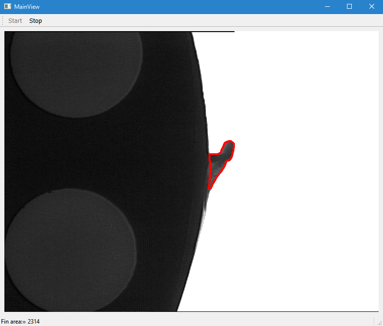
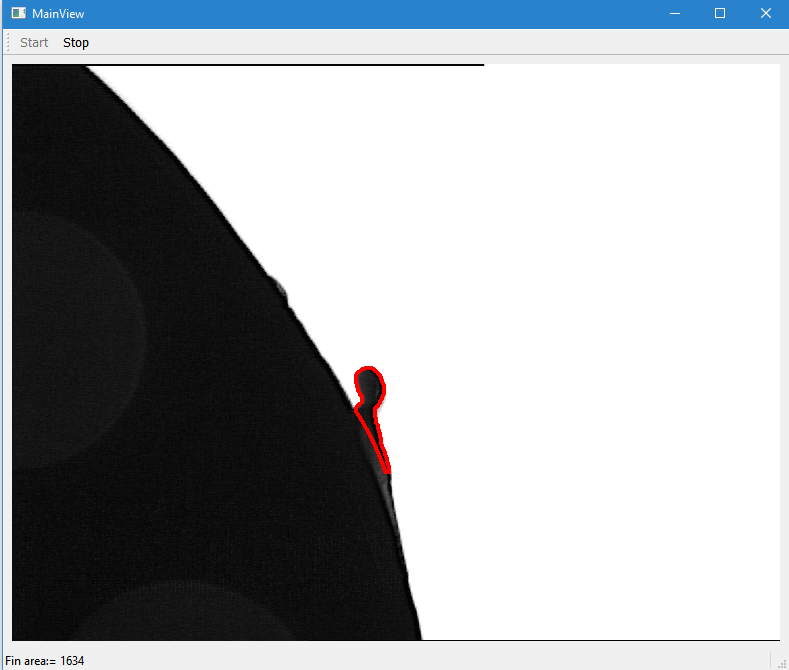
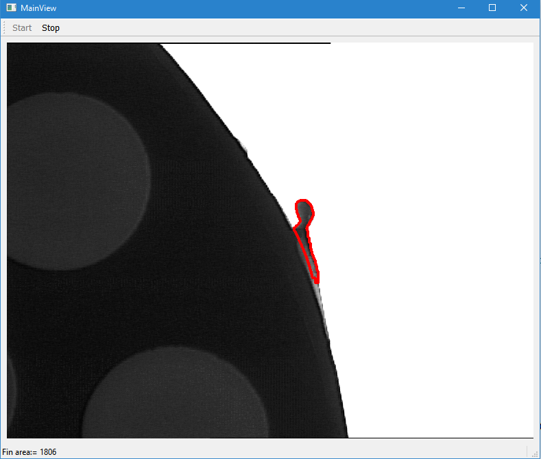

# QtHalconExternalProcedure
HDevEngine/C++ example for executing an external procedure

Purpose:
This example program shows how the classes HDevEngine and 
HDevProcedureCall can be used in order to implement a fin detection 
application. Most of the application's functionality is contained in the
HDevelop external procedure detect_fin(), which can be found in the 
procedures directory. The procedure takes an image as input object parameter
and returns a region and its area as output parameters. In the action 
routine DetectFin() the following basic steps are executed:
1. The external HDevelop procedure 'detect_fin' is loaded and a call to the procedure is created.
2. An image is grabbed and passed as input parameter to the procedure call.
3. The procedure call is executed.
4. The output parameters of the procedure call are retrieved and displayed in the graphics window. 
Steps 2-4 are executed repeatedly for different images.
  
#  Re-implementation

  The example is re implemented using Qt 5.x , QMainWindow and QThread
  
  ## Result1
  
  
  
  ## Result2
  
  
  ## Result3
  
  
